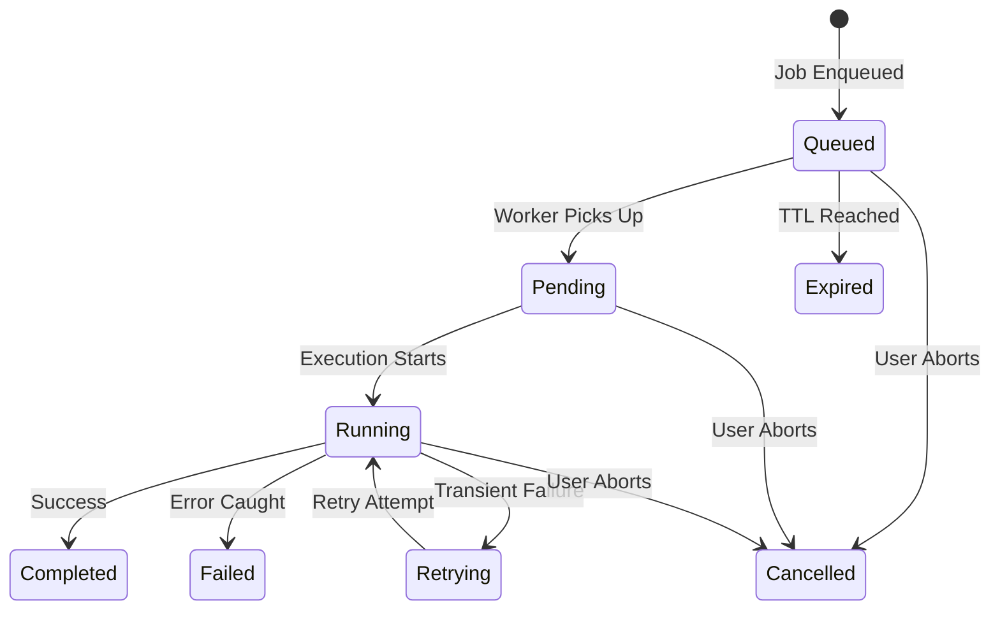
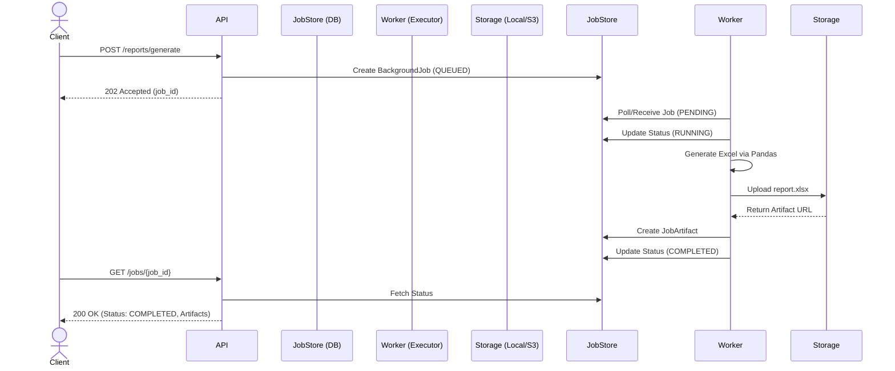
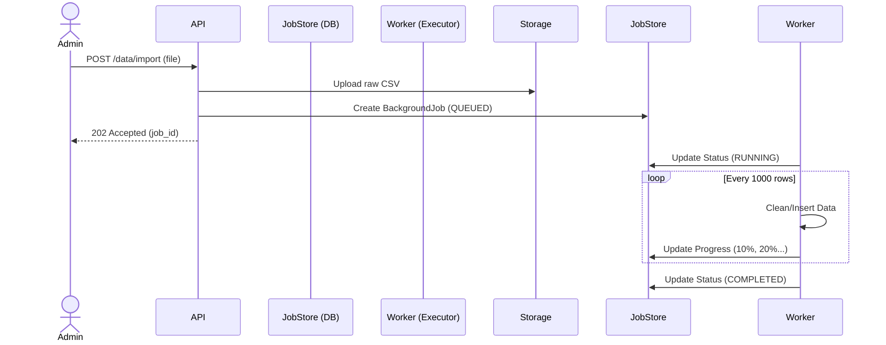
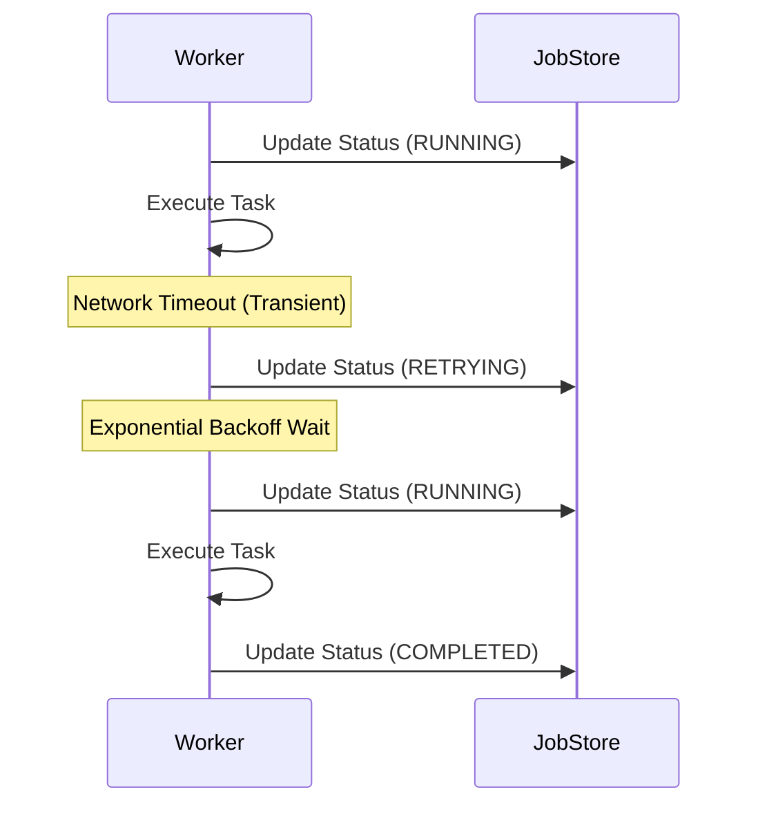
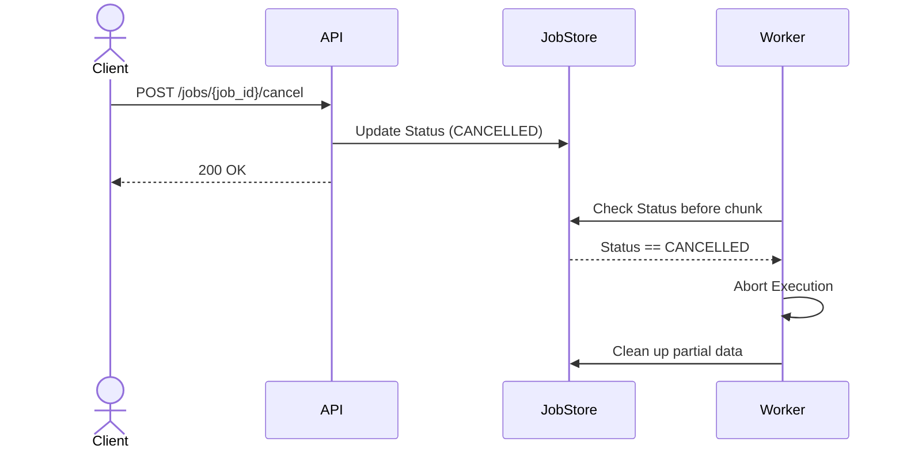

# Background Job Architecture Blueprint

This document defines the queue-agnostic architectural blueprint for handling asynchronous, long-running tasks (e.g., Export generation, Data Imports) in the application.

---

## 1. Valid State Transitions

The system utilizes a strict state machine to prevent race conditions during distributed execution.



---

## 2. Queue-Agnostic API Contracts

The API boundary separates the Web Tier from the Execution Tier, ensuring we can swap backends (e.g., Sync -> Celery -> SQS) without breaking clients.

### Submit Job (e.g., Export Excel)
`POST /api/reports/generate`
**Payload:** `{"violation_type": "age", "districts": ["D1"]}`
**Response:** `202 Accepted`
```json
{
    "job_id": "c38a31de-74de-418b-9318-415c43dd83e1",
    "status": "Queued"
}
```

### Poll Job Status
`GET /api/jobs/{job_id}`
**Response:** `200 OK`
```json
{
    "job_id": "c38a31de-74de-418b-9318-415c43dd83e1",
    "status": "Completed",
    "progress": 100,
    "artifacts": [
        {
            "name": "report.xlsx",
            "url": "https://storage.local/downloads/report.xlsx"
        }
    ]
}
```

---

## 3. Sequence Diagrams

### 3.1 Export Lifecycle (Polling Flow)


### 3.2 Import Lifecycle (Progress Tracking)


### 3.3 Retry Flow (Transient Failures)


### 3.4 Cancellation Flow


---

## 4. Idempotency Strategy

Duplicate requests often occur due to network retries from the client.
- **Idempotency Key:** The frontend must provide a hash of the request parameters (or an explicit `Idempotency-Key` header).
- **Behavior:** The `JobDispatcher` will query the `JobStore` for an active job (Status: `Queued`, `Pending`, `Running`) with the matching `idempotency_key` and `owner_id`.
- If found, it returns the *existing* `job_id` rather than queuing a duplicate.
- If no active job is found (e.g., previous attempt `Failed` or `Expired`), a new job is enqueued.

---

## 5. Storage Strategy

- **Temporary Storage:** Artifacts are written to `/tmp/django_jobs/`. 
- **Artifact Retention:** JobArtifact records and their files are retained for 7 days.
- **Cleanup Policy:** A separate recurring cleanup job (e.g., via Django-APScheduler or Celery Beat) executes nightly, querying `BackgroundJob.objects.filter(created_at__lt=7_days_ago)` and deleting associated blobs from Storage.
- **Large File Streaming:** Downloads will proxy through Django via `StreamingHttpResponse` if on local disk, or redirect directly to Pre-Signed S3 URLs to save application bandwidth.

---

## 6. Failure Strategy

- **Retry Policy:** Network timeouts and DB Deadlocks trigger an automatic retry.
- **Exponential Backoff:** Retries happen at `2^retry_count * 10` seconds, capped at 5 retries.
- **Partial Failures (Imports):** Data imports wrap row insertions in database transactions. If a job fails mid-way, the transaction rolls back, leaving the database clean.
- **Dead-Letter Strategy (Future):** Jobs that permanently fail 5 times are marked `FAILED`. Their JSON payloads are preserved indefinitely for developer analysis.
